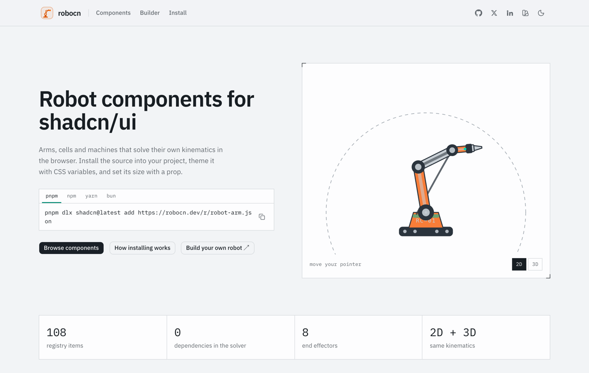
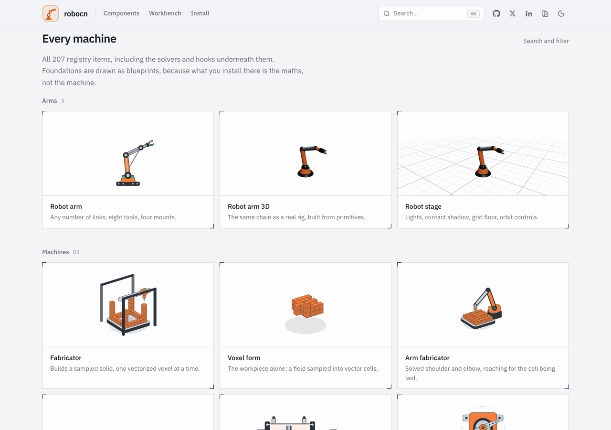
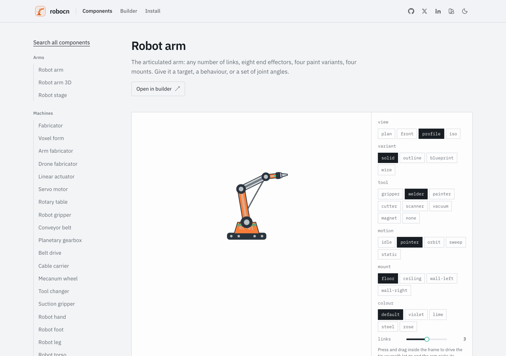
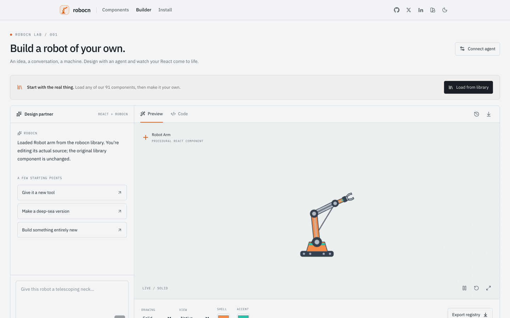

# robocn

**Robot components for shadcn/ui.** A [shadcn registry](https://ui.shadcn.com/docs/registry)
of machines that solve their own kinematics in the browser: articulated arms in SVG and
WebGL, production-line cells, mobile robots, robotic animals, and sensor displays.
Articulated arms solve their poses from real kinematics; rovers, drones, and lidar displays
accept controlled poses or sensor data. Components are procedural SVG or WebGL, not sprite
sheets.

[**robocn.dev**](https://robocn.dev) · [Components](https://robocn.dev/docs) ·
[Builder](https://robocn.dev/builder) · [Install](https://robocn.dev/docs/installation) ·
MIT licensed

<picture>
  <source media="(prefers-color-scheme: dark)" srcset="docs/screenshots/landing-dark.png">
  
</picture>

Components install as source into your project, the way shadcn/ui components do. Own them,
edit them, theme them with CSS variables.

```bash
pnpm dlx shadcn@latest add https://robocn.dev/r/robot-arm.json
```

## What is in it

Every item below is on [the landing page](https://robocn.dev), running, at the size it
installs at.

<picture>
  <source media="(prefers-color-scheme: dark)" srcset="docs/screenshots/catalogue-dark.png">
  
</picture>

| Item | What it is |
|---|---|
| `utility-droid` | Cylindrical service droid with three series, rotating sensor dome, chassis layouts, and deployable tools. |
| `orb-droid` | Rolling spherical companion with an independently stabilized head and pointer-tracking optic. |
| `bellows-droid` | Soft-shell pneumatic pod: a pleated dome that inflates and settles on a volume-conserving profile, carrying its lens pods and vent with it. Grab the crown. |
| `robot-avocado` | Split-shell specimen pod: one body of revolution halved on its own centre plane, the two halves tilting apart on a rod under the machine while the stone rides up out of the gap on a screw column. Shut, it reassembles exactly. |
| `robot-strawberry` | Berry-shelled field unit whose sensor studs are placed by the golden angle over *equal areas* of its own skin and run out along their own surface normals, under a calyx of rigid blades on one hinge. |
| `robot-tomato` | Truss-hung crop unit: a clamp, a peduncle with two hinges sharing one swing angle, a lobed shell, and a ripening front that is real coverage of the surface rather than a colour ramp. The only machine here that hangs. |
| `robot-sunflower` | Heliotropic collector mast: a golden-angle floret lattice on a dished head, aimed at the light by a solved two-axis tracker, on a stem that leans toward it while the gimbal collar takes up exactly what the stem did not. The spiral arms are found in the lattice, not placed in it. |
| `protocol-droid` | Humanoid translator with controlled postures, gestures, head angle, and optional exposed wiring. |
| `security-droid` | Tall angular guard frame with patrol poses, pointer-tracking sensor bar, and alert state. |
| `medical-droid` | Clinical assistant with diagnostic readout and independently selected instrument arms. |
| `infantry-droid` | Light or heavy field frame with controlled poses and utility equipment modules. |
| `probe-droid` | Hovering survey platform with steerable optics, scan cone, and three to six appendages. |
| `courier-droid` | Compact floor-running service bot with steering, tread travel, antennas, and cargo modules. |
| `casing-droid` | Armoured conical casing unit: three skirts and domes, sized hemisphere grid, neck cage, elevating eyestalk, manipulator and emitter. |
| `astromech-droid` | Barrel repair unit: tripod/bipod ride heights, three domes, liveries, feet and antennas, service ports, periscope and holo cone. |
| `attendant-droid` | Plated etiquette humanoid: three builds, faceplates and hands, optional collar, and plating that strips back to the loom. |
| `cyber-trooper` | Converted armoured humanoid: three helmets and visors, two builds, shoulder and jaw options, three chest units, power reserve. |
| `pylon-droid` | Deployable survey pylon: stowed it is a sharp triangular plate with every limb folded inside its own outline, and one deploy number stands it on a tripod with its apex cap lifted off a lit core. |
| `robot-hound` | Boxy companion tracker on a concealed drive: one attention number runs the collar out, lifts the nose, pricks the ear dishes and raises the telescoping probe; the only animal in the set with no legs. |
| `guide-droid` | Rotor-lifted visitor guide: one hover number flies it and stretches the coil springs its hands and feet ride on, with ring optics, a speaker grille, and a drag to fly it by hand. |
| `monolith-droid` | Slab-bodied walker with no limbs: a rectangular column sliced into parallel slabs, each hinged at its own top face, that splay into a braced stance and stride half a cycle apart. |
| `custodian-droid` | Floating armoured custodian: the casing is a ring of armour segments on radial rails, and one number blooms them into a corona off a lit chassis, with a gimballed optic behind a three-arm bracket cage. |
| `sentinel-console` | Bulkhead-mounted watch station: an identity strip, a gimballed optic on visible trunnions, a solved iris diaphragm that stops down to a pinhole, and a voice grille. The one machine that is part of the ship. |
| `robot-fish` | Swimming fish in profile: a tail-weighted body wave, working fins, pointer steering, a dart on click. |
| `robot-snake` | Serpentine crawler in plan: even wave, sidewinding lift with contact marks, a coil, a strike on click. |
| `spine-kinematics` | Serpenoid travelling-wave body solver, with taper, steady turn and ground clearance. |
| `bear-kinematics` | Plantigrade stance: a rigid sole placed on the floor with the leg solved to the ankle it produces, the base of support those intervals make, and the static load at each contact. |
| `robot-spider` | Eight-legged walker in plan with solved knees, three gaits, and a crouch on click. |
| `robot-crab` | Sideways walker: the same gait turned across the body, hinged claws, tracking eyestalks. |
| `hexapod-kinematics` | Radial four-to-ten-leg walker solver: tripod, wave and ripple gaits, knees solved per leg. |
| `robot-bird` | Perching flyer: three-link wings carrying fanned feathers, a beat cycle, a takeoff on click. |
| `robot-dragonfly` | Four-winged flyer in plan: fore and hind pairs half a cycle apart, a solved abdomen, a dart on click. |
| `robot-bat` | Membrane flyer: four finger struts with the skin drawn through their tips, an inverted roost, a drop on click. |
| `robot-jellyfish` | Pulsing bell: one number narrows, deepens and flares the whole surface, over a rippling curtain of solved tentacles. |
| `robot-manta` | Ray whose travelling wave runs across the span, with a roll that genuinely foreshortens it. |
| `robot-octopus` | Mantle and eight independently solved arms, mounted on a ring, reaching for the pointer. |
| `robot-seahorse` | Upright swimmer whose prehensile grip is the spine solver's steering taken to the stop. |
| `robot-ant` | Six-legged forager with three body sections on a bending chain, tracking antennae and a cargo module. |
| `robot-scorpion` | Eight legs plus a metasoma solved in the sagittal plane, so the arch is a real height. |
| `robot-mantis` | Raptorial forelimbs solved to a real target — the only animal here with somewhere to reach. |
| `robot-frog` | Solved hind legs driven through crouch, launch, trail and landing by one pair of numbers. |
| `spring-hopper` | The first machine here that bounces: a real helical spring with a solid height it can hit, and a contact time that falls out of the spring rate. |
| `ball-hopper` | A shell that is its own compliance — flattened at constant volume, so it has to get exactly that much wider — and comes to rest in finite time. |
| `hopper-dynamics` | The bounce solver: an exact parabola in the air, an exact spring-mass stance, and the duty factor derived rather than dialled. |
| `robot-turtle` | The gait solver at four legs, under a procedurally plated carapace everything retracts into. |
| `robot-cat` | Four solved legs whose roots are the two ends of a solved spine: the arch moves them both. |
| `robot-dog` | The cat's twin with a floating shoulder: the hip is a spine joint, the shoulder is the far end of a swinging scapula, the neck is solved to the floor, and the tail is solved across the centre plane so the wag runs out of the drawing. |
| `robot-fox` | The third answer to what moves a leg root: the whole body tips about its hip. The brush is an output rather than an input, and the two ears pan onto one quarry so their axes converge. |
| `robot-bear` | The quadruped that stands up: soles that are intervals rather than points, so the feet make a base of support with edges, and a balance rule that keeps the centre of mass inside it — or does not, and topples. |
| `robot-polar-bear` | The same chassis with a second support system: one number hands the load from the soles to the water, the hind limbs trail, and the forelimbs solve to a stroke path. |
| `robot-panda` | The bear that sits down to use its hands: the seat is a third contact that buys back the base both forepaws just left, and the pseudo-thumb's gap is an output of what is held. |
| `robot-horse` | The first machine whose gait is a real thing rather than a label: named footfall sequences with the beat counted off them, and a fetlock and a neck that are both driven by the load each foot is carrying. |
| `robot-pegasus` | The only machine here with two ways of holding itself up: one number hands its weight from its legs to its wings, and the fetlocks, the fold, the stride and the beat all answer it. Its wing is three bones solved to a tip tracing a figure of eight. |
| `robot-camel` | The only machine whose floor is not a line. Its ground has a depth and its feet go into it — less far because the pad opens under the load and drops its own pressure. The hump is a store that slumps, and the roll is an output of the gait. |
| `robot-inchworm` | A looper that moves by alternating anchors, with the arch height solved from the anchor span. |
| `micro-duck` | Bipedal duck robot: solved legs, a craning neck, and a beak that opens. |
| `duck-kinematics` | Pure biped pose solver: footfall cycle, S-curve neck chain, hinged beak. |
| `reachy-mini` | Companion head on a six-rod parallel platform, with tracking eyes and antennas. |
| `stewart-kinematics` | Closed-form six-degree-of-freedom Stewart platform IK with stroke limits. |
| `robot-quadruped` | Four-legged robot with solved gait poses and controlled stance. |
| `quadruped-kinematics` | Pure two-link leg solver with standing, walking, and trotting trajectories. |
| `fabricator` | Additive build cell: a three-axis head laying a sampled solid voxel by voxel, six shapes, a resolution axis, four camera angles. |
| `arm-fabricator` | The same build on an articulated arm: a yawing turret and a solved shoulder and elbow reaching for each cell. |
| `drone-fabricator` | The same build with no envelope: a repulsor platform that flies to each cell and banks into its travel. |
| `voxel-form` | The workpiece on its own — the sampled solid, with no machine around it. |
| `voxel-geometry` | Continuous occupancy fields sampled into buildable voxels, in deposition order, with the buried cells dropped, and the paths to draw them. |
| `linear-actuator` | Controlled cylinder stroke with optional piston cutaway. |
| `servo-motor` | Positional servo with single, double, or cross horns. |
| `rotary-table` | Rotary indexing platter with controlled angle and up to twelve fixtures. |
| `robot-rover` | Four- or six-wheel ground robot with controlled heading, steering, and tread travel. |
| `robot-drone` | Quad- or hexacopter with counter-rotating propellers and optional guards. |
| `lidar-scan` | Polar range display for supplied angle-distance samples. |
| `vehicle-geometry` | The constraints a vehicle works against: Ackermann steering, steady-state articulation, the coordinated bank, a rigid body on N axles, the rocket equation, and surface-piercing foil lift. |
| `robot-car` | An autonomous road car whose two front wheels are solved from one steering angle, with the lean the turn radius implies and a body that rides the road on its own axles. |
| `transit-bus` | An articulated city bus whose rear section angle is solved from the hitch, with plug doors, a concertina at the joint, and a kneel that rides on the doors' own number. |
| `rail-geometry` | What a track does to the vehicle on it: bogies placed on a curve with the centre and end throw that follow, Klingel hunting on a coned wheelset, a pantograph solved to a working height, and a turnout's lead, crossing angle and blade throw. |
| `rail-locomotive` | An electric locomotive and its train, placed by the track rather than steered along it: each bogie takes the tangent under its own pivot, each body is the chord between two of them, and the sideways throw of the middle and the ends falls out. |
| `rail-bogie` | A powered two-axle bogie, and the only self-excited motion in the set: nothing commands the wheelsets to wander, they wander because they are coned — at exactly Klingel's wavelength, until the flange stops them. |
| `pantograph-collector` | A single-arm roof current collector that spends reach to buy height, with a control-rod loop that keeps the head level over its working range and a contact wire strung with real stagger. |
| `rail-turnout` | The points: two blades on one throw bar, a route that is detection rather than a setting, and a crossing angle that is the turnout number and nothing else. |
| `gridiron-geometry` | The football family's maths: the ball as a real prolate spheroid whose outline is its own central section, drag-free ballistics, counter-rotating wheel exit conditions, a route tree sampled by arc length, a sprung pad arm at equilibrium, and the column pitch a hand on the turf implies. |
| `robot-football` | The ball, modelled rather than drawn: end-on it is a circle of the waist radius and broadside it reaches the full length, and the laces are stitches on the surface that go round the back when it spins. |
| `gridiron-lineman` | The three-point stance as the four-contact stance it is: the hand on the turf carries load, and the flat back is the column pitch that puts the shoulder exactly one arm's length from it. |
| `gridiron-quarterback` | A drop-back and a throw with the arm solved to a release point travelling an arc, so the elbow is an output and the ball leaves on the velocity the hand had. |
| `gridiron-receiver` | The route tree as geometry: a point at an arc length along a polyline, with the heading turning the machine and the lean falling out of the exterior angle at the break. |
| `gridiron-kicker` | A swing leg solved to an ankle path that passes through the ball, and a parabola that starts where the strike happened. Clearing the bar is computed, not declared. |
| `blocking-sled` | Pads at a static equilibrium — the load's moment against a return spring's — on a frame that will not move at all until the drive beats the friction under its skids. |
| `ball-launcher` | Two counter-rotating wheels: exit speed is the mean of their surface speeds and spin is their difference over the ball's own diameter, both off the same pair of inputs. |
| `cargo-plane` | A high-wing freighter that banks because it was asked to turn, with ailerons carrying the roll it has not finished. |
| `hydrofoil-craft` | A foilborne ferry that climbs out of its own ground plane: lift goes as v², so the surface-piercing V sheds wetted area as she rises. |
| `launch-vehicle` | A two-stage booster that flies a pitch program, gimbals against it, stages, and reports the ideal Δv left from the rocket equation. |
| `strike-starfighter` | A split-foil attack fighter: four wings on two fore-aft hinges that open from a cruise plane into an X, carrying their engines and cannons with them. |
| `ion-interceptor` | A twin ion-drive interceptor: hexagonal panels pitching on lateral pylons around a pod that yaws inside them. |
| `robot-gripper` | A standalone parallel or angular gripper with controlled jaw opening. |
| `conveyor-belt` | A conveyor with automatic or controlled travel, reversible direction, and workpieces. |
| `transmission-geometry` | Gear outlines and mesh phase, assembly-valid planetary trains, taut belt paths, and an energy chain folded over its bend. |
| `planetary-gearbox` | A reduction stage with its face off: sun, planets and a held ring, with real meshing teeth and the ratio read off the tooth counts. |
| `belt-drive` | A toothed belt on its real tangents and wrap angles, with an idler you can wind down and teeth that march by arc length. |
| `cable-carrier` | The energy chain that feeds a moving axis, its fold travelling at exactly half the carriage. |
| `mecanum-wheel` | Six to fourteen barrel rollers modelled at 45° out of the wheel plane, in a left hand and a right. |
| `tool-changer` | A robot-side and tool-side coupler that comes apart: seat the halves, then drive the lock balls out. |
| `suction-gripper` | A bar of bellows cups that lands on a sheet, compresses against it, and carries it on the lips. |
| `robot-hand` | Five digits on a thumb with a real saddle joint: fingers that abduct, seven named grasps, a handedness, and the pad gap a pinch closes. |
| `robot-foot` | An ankle and a hinged toe plate rolling through a stance, with the load moving from the heel to the ball to the toe. |
| `robot-leg` | A hip, knee and ankle solved to wherever the foot has to be. Grab it and the foot is yours. |
| `robot-torso` | A pelvis, a column of equal vertebrae, and a cage of rib hoops that opens as it breathes. |
| `robot-skeleton` | The whole biped, walking. A run is a walk with the duty factor under a half, and it says when both feet are off the floor. |
| `hand-kinematics` | The hand solver: five digits in one frame, a two-angle saddle thumb, and the pinch gap that falls out of it. |
| `skeleton-kinematics` | The biped solver: stride cycles, a foot that rolls over a planted sole, an equal-segment spine, counter-swinging arms. |
| `motion-platform` | A six-axis Stewart base under a payload deck, with visible stroke and a fault when a pose asks for more travel than it has. |
| `produce-geometry` | Solids of revolution with a real profile: the surface, a golden-angle lattice spaced by equal surface area, half shells that reassemble, a hinge about any line, and blades that keep their length at every pitch. |
| `electromagnetism-geometry` | Helical winding points, balanced three-phase vectors, and ideal resolver sine/cosine channels. |
| `solenoid-valve` | A coil-driven plunger switching a visible two- or three-port flow gallery. |
| `electromagnetic-relay` | An energized coil pulling an armature across one or two contact sets. |
| `induction-motor` | Three stator phases producing a rotating field around a squirrel-cage rotor. |
| `stepper-motor` | Four energized phases indexing a toothed rotor through discrete steps. |
| `voice-coil-actuator` | A moving coil travelling bidirectionally through a fixed annular magnet gap. |
| `magnetic-bearing` | Four opposed electromagnets centering a visibly unsupported rotor. |
| `eddy-current-brake` | A magnet array overlapping a conductive disc to illustrate contactless braking. |
| `maglev-carriage` | A levitated carriage travelling above a segmented linear stator. |
| `magnetic-gripper` | Switchable pole shoes capturing and lifting a steel workpiece without jaws. |
| `inductive-sensor` | A metal target moving through the qualitative lobe of an oscillator coil. |
| `resolver` | A rotary transformer producing ideal sine and cosine position channels. |
| `transformer-core` | EI and toroidal cores with selectable winding ratios and reversible flux. |
| `device-geometry` | The mechanisms in a machine you carry: a hinge, a kickstand that has to close, rotary detents that wrap, a constant-pitch link band, and a screen on a plane at any attitude. |
| `keyboard-geometry` | The mechanisms under a machine you type on: travel with real hysteresis, an asymmetric keystroke, a unit-pitch deck with a stagger, matrix scan order, and caps standing on a raked face. |
| `key-switch` | One mechanical keyswitch, sectioned: a stem on a coil spring whose contact closes partway down the travel and opens again higher than it closed. |
| `robot-keypad` | A raked bench entry pad on a scanned matrix: the key that is down and the cell the scan is reading are two different things, and both are drawn. |
| `robot-keyboard` | A whole key deck placed by a unit grid: rows in 1u, 1.25u and 6.25u widths on one pitch, caps sculpted per row, and a split layout whose halves are genuinely turned apart. |
| `input-terminal` | A bench console with two coupled mechanisms: a head canted on a hinge, and a key deck whose strokes are what put glyphs on its screen. |
| `clamshell-laptop` | A portable workstation on one solved hinge: the lid keeps its length, the screen only draws from a camera that can see it, and the hinge stops at the travel it has. |
| `slate-tablet` | A slate and its kickstand on one recline axis, with the foot solved onto the desk — and folded flat when the leg is too short to reach. |
| `wheel-player` | A pocket media player whose click wheel is geared to its list: one turn is one pass, the detents wrap, and the hold switch is a real interlock. |
| `slab-handset` | A touchscreen slab turned about its own axis: edge on at a quarter, back and camera array at a half, and a display re-laid-out rather than rotated for landscape. |
| `wrist-terminal` | A wrist display with a crown geared to its dial and a link band that keeps its length however far it is opened. |
| `sound-geometry` | The closures in a machine that makes a sound by moving something: a spiral groove, a pivoted tonearm's tracking error, an exponential horn, a spring governor, a tuned comb, and a pinned barrel. |
| `piano-geometry` | The closures in a grand: an action whose ratio is a product of three levers and whose jack lets the hammer go before the blow, a back check, a late damper, a scale that cannot be ideal, and the bent side that is the envelope of it. |
| `turntable-deck` | A belt-drive deck whose arm is geared to its platter by the groove: one revolution walks the stylus in one groove pitch, and the tracking error is in the readout. |
| `gramophone-horn` | The acoustic deck a century earlier: a mainspring whose governor holds the speed until it runs down, a crank that is the wind, and an exponential horn. |
| `music-box-drum` | A pinned barrel bending a comb tuned by length, and letting go the instant the pin reaches the tip. The notes are a pattern you pass it. |
| `robot-grand-piano` | A player grand whose roll drives 88 solved actions. The jack lets each hammer go before it reaches the string, the back check catches it coming down, and the bent side of the case is the envelope of the string scale. |
| `busker-droid` | A one-machine band whose pose comes from data: a step pattern raises each beater and drops it on the beat, both arms solved to what they are about to hit. |
| `celestial-planet` | A tilted, turning globe with latitude bands, polar caps, longitude storms and a ring system the body genuinely occludes — the far arc is cut where the silhouette crosses it, and the day-night line is a projected great circle. |
| `celestial-moon` | The phase machine: a lunation whose crescent is the projection of the terminator circle rather than a drawn shape, and a libration that rocks the body so the limb craters come round and go again. |
| `celestial-star` | A luminous body drawn from the limb-darkening law rather than a gradient, with granulation, a rotating spot belt, prominence loops anchored on the limb, and a corona. |
| `celestial-asteroid` | An irregular body whose radius is a deterministic sum of cosine lobes, so its silhouette genuinely changes as it turns — and it tumbles about an axis that is itself going round. |
| `orrery` | A geared model of a system: bodies carried on radial arms whose length *is* the orbital radius, running fast at periapsis and slow at apoapsis on real Kepler ellipses with the hub at a focus. |
| `battle-station` | An armoured orbital station whose hull is a real tiling: the breakup launches every plate down its own line behind a fracture front, and putting it back reassembles the sphere exactly. A girdle trench, a plating axis, and a dish that focuses because it is a paraboloid. |
| `debris-field` | What is left: a population of hull fragments on straight trajectories from one rupture, each released at its own moment and turning at its own rate — the only drawing here that has to decide what is in front of what. |
| `robot-arm` | The articulated arm. Any number of links, eight end effectors, four paint variants, four mounts. |
| `robot-arm-3d` | The same arm as a procedural react-three-fiber rig. |
| `robot-stage` | Canvas, lights, contact shadow, grid floor and orbit controls for the 3D items. |
| `scara-arm` | A SCARA cell in plan view: two rotary links, a Z spindle, the swept area. |
| `delta-arm` | A parallel delta in isometric, solved with the closed-form delta IK. |
| `gantry-arm` | A cartesian gantry with independent axes and an optional plotter trail. |
| `robot-face` | A head whose eyes follow the pointer, with six moods. |
| `robot-loader` | A pick-and-place cycle as a loading indicator, determinate or not. |
| `arm-controls` | A teach pendant: one slider per joint, driving an arm in forward kinematics. |
| `robot-kinematics` | The solver. No React, no three.js, no dependencies. |
| `phyllotaxis-geometry` | The golden-angle disc, the Fibonacci spiral arms that fall out of it, a dished face and its normals, and a two-axis aim solved from a direction. |
| `celestial-geometry` | Kepler's equation solved to machine precision, ellipses about a focus, the terminator great circle, illumination and limb darkening, body frames, and a deterministic irregular radius field. |
| `hull-geometry` | A sphere tiled into armour plates by equal area, whose areas sum to exactly one; a fracture front and the straight-line travel behind it; a shock ring as a real circle in a stated plane; and a paraboloid dish carrying its own focal length. |
| `robot-style` | Sizes, variants, palette resolution, and the theme variables and keyframes. |
| `robot-color` | CSS variables and `oklch()` turned into something three.js can parse. |
| `use-robot-arm` | Animated pose for a link chain, plus `useEasedPoint`. |
| `use-pointer-target` | Pointer position in a component's own world units. |
| `use-robot-motion` | The clock the machines run on, the rate limiter, and press-and-drag control. |
| `linkage-geometry` | Closed-loop kinematics: a four-bar solved as a circle intersection, a slider-crank with an analytic stroke, and block-and-tackle travel from rope length. |
| `pumpjack` | A beam pump with its four-bar actually solved: the polished-rod stroke is what the link lengths produce, not a number anyone typed. |
| `drilling-derrick` | A travelling block that is reeved rather than positioned — the drum's payout is shared between the lines, so advantage is visible as rope. |
| `mud-pump` | One, two or three slider-cranks on a shaft, with a discharge summed from the solved piston velocities. |
| `wellhead-tree` | The valve stack on a well: rising stems show their state, and the accent follows only the bore the open valves leave through. |
| `storage-tank` | A floating roof riding the liquid, with a rolling ladder solved from wherever the roof is. Or a cone roof, which tells you nothing. |
| `oil-tanker` | The one machine whose ground plane cuts through it: cargo carries the boot top and the load line under the waterline. |
| `tanker-truck` | Two rigid bodies on one kingpin, where the hitch is a real yaw in world space and the compartments empty from the rear. |
| `flare-stack` | A knockout drum, a derrick-supported riser and a lit tip, under a plume whose length is a proportion and whose lean is the wind. |
| `fractionating-column` | A crude tower whose tray count rebuilds the column — spacing, seams and draw heights all come off it. Four named cuts. |
| `jackup-rig` | Fixed-length legs and a hull that climbs them: one number is both the air gap above the water and the stick-up above the deck. |
| `household-geometry` | The closures in the building you live in and the machines inside it: a leaf that keeps its width, sectional panels that keep their length round a bend, a drum whose regime is one Froude number, a resonant tub, a roped hoist, and tracking slats that report their stops. |
| `gabled-house` | A dwelling drawn as a machine: the ridge height is the pitch you pass it, the garage door's rigid panels ride one track from vertical to horizontal, and the fins and the array turn to face a sun that is just the time of day. |
| `tower-block` | A residential tower with the lift left visible: the storey count is the height and the travel at once, and the counterweight falls exactly as far as the car rises. |
| `espresso-machine` | A spring-lever group drawn as the linkage it is — lever, rod, piston — where the declining shot pressure is the spring paying its force back rather than a curve anyone drew. |
| `refrigerator` | A cabinet whose doors are solved leaves on vertical hinges, with an interior that is a second drawing revealed by the swing and a lamp thrown by a real door switch. |
| `washing-machine` | One drum either side of a Froude number of one: thrown and falling below it, pinned to the wall above it — and a tub that is worse at its critical speed than at full spin. |

Installing a component pulls in what it needs: `robot-arm` brings `robot-kinematics`,
`robot-style` and both hooks, and the theme variables ride along with `robot-style`.

## Usage

```tsx
import { RobotArm } from "@/components/ui/robot-arm"

export function Hero() {
  return (
    <RobotArm
      links={[1, 0.82, 0.34]}
      tool="welder"
      behavior="pointer"
      size="lg"
      showEnvelope
    />
  )
}
```

The SVG machines share colour, size, and paint variants. Motion and mechanical
controls depend on the component; each docs page lists its supported props.

**Colour.** Four roles — `shell`, `metal`, `dark`, `accent` — each resolving from a prop,
then a CSS variable, then a built-in default.

```tsx
<RobotArm color="oklch(0.58 0.2 292)" accent="#f5d90a" />
```

```css
:root {
  --robot-shell: oklch(0.72 0.17 47);
  --robot-accent: oklch(0.72 0.15 176);
}
```

**Size.** `size` takes a scale step (`xs`–`xl`) or a pixel number. Geometry lives in a fixed
viewBox, so size only ever scales the drawing. Arms also support `thickness` to scale
limb weight separately.

**Form.** `variant` is `solid`, `outline`, `blueprint` or `wire`. Blueprint adds the grid,
the dimensions or the joint angles where applicable. On articulated arms, `tool` picks
the end effector and `mount` bolts the machine to the floor, ceiling or wall.

**Motion.** Every machine moves on its own. Leave the value prop out — `extension`,
`angle`, `phase`, `heading` — and it runs `behavior`: a cylinder works its duty cycle, a
servo sweeps or steps, a table indexes, a rover patrols, a drone hovers, a lidar ray
sweeps, the duck walks. Supply the value and the loop stops: controlled always wins, which
is how every one of these components already worked. `speed` scales the cycle, `phase`
offsets it, `paused` freezes it, and `animate={false}` or a reduced-motion preference parks
it. Arms keep their own vocabulary — `behavior` is `pointer`, `orbit`, `sweep`, `idle` or
`static`, or drive them with a `target`, a function of elapsed seconds, or an `angles`
array. A settled pose costs no renders.

**Interaction.** `interactive` turns a machine into a control: drag the actuator's rod, the
servo horn, the gripper's jaws, the conveyor belt, the rotary platter, or an arm's tool tip;
arrow-key any of them; click a fixture to index it; press to send the rover a bearing or fly
the drone. While you hold it, the machine tracks the pointer exactly; let go and it eases
back into whatever its behaviour has moved on to, rate-limited the way a servo returns.
Every draggable is also a `role="slider"` with the value on it, and every gesture starts
with a press, so touch devices get the same control a mouse does.

The details, per machine, are in [docs/motion-and-interaction.md](docs/motion-and-interaction.md).

## Examples

Every component page on the site is a bench: the machine on the left, every prop it takes
wired to a control on the right, and the install line for it above.

<picture>
  <source media="(prefers-color-scheme: dark)" srcset="docs/screenshots/docs-dark.png">
  
</picture>

**A machine that runs itself.** Leave the value prop out and it works its own cycle.

```tsx
import { RobotRover } from "@/components/ui/robot-rover"

<RobotRover wheels={6} behavior="patrol" label="ROVER / 06" />
```

**The same machine, controlled.** Supply the value and the loop stops — controlled always
wins.

```tsx
import { LinearActuator } from "@/components/ui/linear-actuator"

<LinearActuator extension={0.62} cutaway />
```

**A machine as a control.** `interactive` makes it draggable and arrow-keyable, with a
`role="slider"` on the handle; let go and it eases back into its behaviour.

```tsx
import { RobotGripper } from "@/components/ui/robot-gripper"

const [opening, setOpening] = React.useState(0.4)

<RobotGripper interactive opening={opening} onOpeningChange={setOpening} fingers="parallel" />
```

**Drive an arm from joint angles.** `arm-controls` is a teach pendant — one slider per
joint, forward kinematics, no solver in the path.

```tsx
import { ArmControls } from "@/components/ui/arm-controls"

const [angles, setAngles] = React.useState([-30, 45, 20])

<ArmControls angles={angles} onAnglesChange={setAngles} tool="welder" />
```

**The same arm in three dimensions.** `robot-arm-3d` is the same chain as a procedural
react-three-fiber rig; `robot-stage` is the canvas, lights, contact shadow and orbit
controls it needs.

```tsx
import { RobotArm3D } from "@/components/ui/robot-arm-3d"
import { RobotStage } from "@/components/ui/robot-stage"

<RobotStage className="h-80 w-full" floor="grid">
  <RobotArm3D interactive links={[1, 0.82, 0.34]} tool="gripper" behavior="orbit" />
</RobotStage>
```

**An animal.** The walkers take the same vocabulary — a view, a size, a variant, and
either a behaviour or the pose numbers themselves.

```tsx
import { RobotCat } from "@/components/ui/robot-cat"

<RobotCat view="profile" size={360} behavior="prowl" label="FELIS / 13" />
```

**A sensor display.** `lidar-scan` takes real angle–distance samples and draws the polar
plot; the sweeping ray is the behaviour on top of it.

```tsx
import { LidarScan } from "@/components/ui/lidar-scan"

<LidarScan samples={samples} maxRange={12} showRays behavior="sweep" />
```

## The kinematics

- Two links solve analytically with the law of cosines, with a chosen elbow side.
- Three or more run FABRIK, seeded with the previous frame so animation stays coherent
  instead of snapping between valid solutions.
- Out-of-reach targets clamp onto the reachable annulus rather than failing.
- The delta and the Stewart platform have their own closed-form solvers; the gantry is direct.
- Everything is plain functions over `{x, y}` and `{x, y, z}` objects, shared by the SVG
  components and the three.js rig.

```ts
import { solveChain2, chainAngles2 } from "@/lib/robocn/kinematics"

const joints = solveChain2({ x: 0, y: 0 }, { x: 40, y: 25 }, [30, 24, 16])
const angles = chainAngles2(joints)
```

## Namespaced install

```json
{
  "registries": {
    "@robocn": "https://robocn.dev/r/{name}.json"
  }
}
```

```bash
pnpm dlx shadcn@latest add @robocn/robot-arm @robocn/delta-arm
```

## Development

```bash
pnpm install
pnpm dev              # docs site and registry, on http://localhost:3000
pnpm generate         # builder runtime + the registry→component gallery map
pnpm registry:build   # writes public/r/*.json
pnpm og               # recaptures the social cards: public/og.png and public/og/*.png
pnpm shots            # recaptures docs/screenshots/*.png, the pictures above
pnpm test             # kinematics, components, registry integrity
pnpm typecheck
pnpm build            # builds the registry, then the site
```

The app is both the docs site and the registry source: every file listed in `registry.json`
lives at the path a consumer installs it to, so what the site renders is exactly what ships.
`registry.json` refers to its own items by URL — the only way one registry item can depend on
another outside shadcn's own registry — so the host is stamped in at build time from
`NEXT_PUBLIC_REGISTRY_URL` (or Vercel's production URL).

The social card at `public/og.png` is a screenshot of `/og`, which is a real page built
from real components — see [the social card](docs/og-image.md) for why, and run `pnpm og`
after changing what it shows. Every docs page has a card of its own under `public/og/`
drawn the same way, so a link to `/docs/micro-duck` previews as the duck rather than as
the catalogue: [a social card per page](docs/per-page-og-images.md), and `pnpm og --only
micro-duck` while you are editing one. The pictures in this README are captures of the
real pages for the same reason: `pnpm shots`, and [the screenshots](docs/screenshots.md)
for the shot list. All of it drives headless Chrome through `scripts/lib/capture.mjs`.

The project describes itself in three places. `package.json` carries the description,
keywords, homepage and repository; `src/lib/site.ts` carries the name, tagline,
description and keywords the `<meta>` tags are built from in `src/app/layout.tsx`, and
`productionUrl` — the host printed on the social card and in the screenshots, whichever
server actually rendered them. The third is GitHub's own repo metadata, which is settings
rather than source:

```bash
gh repo edit --description "…" --homepage https://robocn.dev --add-topic shadcn-registry
```

A test keeps the first two from drifting apart. The repo's social preview image is
`public/og.png`, uploaded by hand under Settings → General → Social preview — GitHub has
no API for it.

The header mark is a machine too: a three-link arm in a work cell, solved by the same core
the registry ships, painted in the same orange, aiming at the cursor anywhere on the page —
[the logo](docs/logo.md), and [the header lockup](docs/header-lockup.md) for the type and
spacing around it.

Adding a component means: write it under `src/components/ui` and add an entry to
`registry.json`. That is the whole requirement — the item is then on the landing page, in
the docs index, on its own docs page with a working demo, and in the sitemap, because all
four are built from the registry and fall back to the component's own default pose when
nobody has written a card or a bench for it. Write the `docs.ts` entry, the card art and
the demo when you want better than the default.

Three things are enforced. The registry test fails if a component imports a robocn file its
registry entry does not depend on — the failure mode that would otherwise ship a broken
install. The catalogue test fails if an item does not reach the landing grid, because the
page shows every item in the registry rather than a curated subset. And the motion test
drives real animation frames at every card and fails the ones that draw the same picture
three seconds later, because a pinned value prop is indistinguishable from configuration in
the source. See [gallery coverage](docs/gallery-coverage.md).

The whole path — solver, component, camera angles, motion, registry, docs, demo, catalogue,
README row, tests — is written up as an agent skill at `.claude/skills/ship-robot/`.

## Robot builder

<picture>
  <source media="(prefers-color-scheme: dark)" srcset="docs/screenshots/builder-dark.png">
  
</picture>

Open `/builder` to load any component from the library, edit its actual React source,
and preview it in an isolated browser sandbox. Connect an OpenAI API key to design new
robots or ask the agent to revise an existing one. Drafts and versions stay in your
browser; export TSX or a shadcn registry item when ready.

See [builder setup and architecture](docs/builder.md) for local/server agent configuration
and deployment. `pnpm dev`, `pnpm build`, `pnpm test`, and `pnpm typecheck` prepare the
builder's runtime from the current library automatically.

## Credits

The kinematics and the rig vocabulary grew out of the fabricator in
[keycaps](https://github.com/TimMikeladze) — a swarm of autonomous arms that bid for work —
generalised here from one bespoke three.js scene into installable components.

## License

MIT © 2026 Tim Mikeladze. See [LICENSE](LICENSE).
